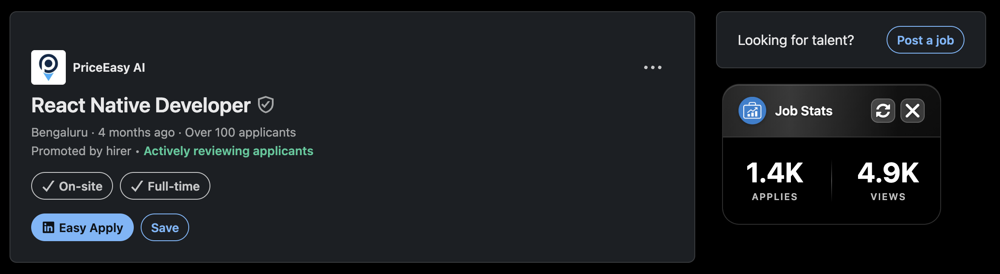

# 💎 LinkedIn Job Insights

A stunning Chrome extension featuring a beautiful glassmorphism floating card that displays real-time LinkedIn job statistics with elegant transparency and blur effects.



## ✨ Features

- **Real-Time Statistics**: View instant job application and view counts
- **🎨 Glassmorphism Design**: Stunning transparent card with backdrop blur and elegant shadows
- **📱 Responsive Layout**: Optimized for all screen sizes with adaptive positioning
- **🔄 Real-Time Refresh**: One-click data updates with smooth loading animations
- **🎯 Smart Positioning**: Auto-positions to stay visible when resizing windows
- **💾 Position Memory**: Remembers your preferred card location across sessions
- **⚡ Instant Access**: Floating toggle button for quick show/hide functionality
- **🎭 Visual Feedback**: Smooth animations and loading states for better UX
- **♿ Accessibility**: Supports reduced motion and high contrast preferences

## 🚀 Installation

### From Chrome Web Store (Coming Soon)
1. Visit the [Chrome Web Store](#) (link will be available after publishing)
2. Click "Add to Chrome"
3. Confirm by clicking "Add extension"

### Manual Installation (Developer Mode)
1. Download or clone this repository
2. Open Chrome and navigate to `chrome://extensions/`
3. Enable "Developer mode" in the top-right corner
4. Click "Load unpacked"
5. Select the extension folder
6. The extension is now installed and ready to use!

## 📖 How to Use

1. **🌐 Navigate to LinkedIn Jobs**: Visit any LinkedIn job posting page
2. **👆 Click the Toggle Button**: Look for the floating "Stats" button in the bottom-left corner
3. **📊 View Beautiful Stats**: The glassmorphism card appears with real-time data
4. **🔄 Refresh Data**: Click the refresh icon to update statistics with smooth animations
5. **🎯 Reposition**: Drag the card header to move it anywhere on your screen
6. **❌ Close**: Click the × button or press ESC to hide the card

## 🎯 Supported Pages

The extension works on:
- Individual job pages: `linkedin.com/jobs/view/[job-id]`
- Job search results: `linkedin.com/jobs/search/`
- Job collections: `linkedin.com/jobs/collections/`

## 🛠️ Technical Details

### Built With
- **Pure Vanilla JavaScript** (zero dependencies)
- **Modern CSS Glassmorphism** with backdrop-filter and transparency
- **Chrome Extension Manifest V3** for enhanced security
- **LinkedIn Voyager API** for real-time data fetching
- **Responsive Design** with mobile-first approach

### Browser Compatibility
- Chrome 88+
- Microsoft Edge 88+
- Brave Browser
- Any Chromium-based browser

### Permissions Required
- `activeTab`: To access the current LinkedIn job page
- `storage`: To save your preferred card position
- Host permission for `*.linkedin.com`: To fetch job statistics

## 📁 Project Structure

```
linkedin-job-insights/
├── manifest.json                                    # Extension configuration
├── content.js                                      # Main functionality script
├── styles.css                                      # Glassmorphism styling
├── Screenshot 2025-10-18 at 6.40.00 PM.png       # Extension preview
├── icons/                                          # Extension icons
│   ├── icon16.png                                 # 16x16 icon
│   ├── icon48.png                                 # 48x48 icon
│   └── icon128.png                                # 128x128 icon
└── README.md                                      # This file
```

## 🎨 Customization

The extension automatically adapts to:
- Light and dark themes
- Different screen sizes
- High contrast mode (accessibility)
- Reduced motion preferences (accessibility)

## 🐛 Known Limitations

- Statistics are fetched from LinkedIn's internal API and depend on your login status
- Some job postings may not have public statistics available
- Requires active LinkedIn session to function

## 🔒 Privacy & Security

- **No data collection**: This extension does not collect, store, or transmit any personal data
- **Local storage only**: Your card position preference is stored locally on your device
- **No external servers**: All processing happens in your browser
- **Open source**: Full source code is available for review

## 🤝 Contributing

Contributions are welcome! Please feel free to submit a Pull Request.

1. Fork the repository
2. Create your feature branch (`git checkout -b feature/AmazingFeature`)
3. Commit your changes (`git commit -m 'Add some AmazingFeature'`)
4. Push to the branch (`git push origin feature/AmazingFeature`)
5. Open a Pull Request

## 📝 Changelog

### Version 1.0.0 (2025)
- ✨ **Initial Release**: Beautiful glassmorphism floating card
- 📊 **Real-time Statistics**: Live job application and view counts
- 🎨 **Modern UI Design**: Transparent background with backdrop blur
- 🖱️ **Draggable Interface**: Position card anywhere on screen
- 📱 **Responsive Design**: Works on all screen sizes
- ⌨️ **Keyboard Support**: ESC key to close
- 🔄 **Refresh Animation**: Smooth loading states and visual feedback
- 💾 **Position Memory**: Remembers your preferred location

## 📄 License

This project is licensed under the MIT License - see the [LICENSE](LICENSE) file for details.

## 👨‍💻 Author

Created with ❤️ by Hemal Joshi

## 🌟 Support

If you find this extension helpful, please:
- ⭐ Star this repository
- 🐛 Report bugs via [Issues](../../issues)
- 💡 Suggest features via [Issues](../../issues)
- 📢 Share with others who might find it useful

## 📧 Contact

- GitHub: [@hemaljoshi](https://github.com/hemaljoshi)
- Email: hemaljoshi738@gmail.com
- LinkedIn: [Hemal Joshi](https://www.linkedin.com/in/hemal-joshi/)

---

**Disclaimer**: This extension is not affiliated with, endorsed by, or officially connected with LinkedIn Corporation. LinkedIn is a trademark of LinkedIn Corporation.